**SOLID Principles**

**Refactoring Documentation**

GTK File Manager — C to C++ Refactor

Branch: solid-refactor

|                         |                         |
|-------------------------|-------------------------|
| **Project**             | GTK File Manager        |
| **Original Language**   | C (GTK3)                |
| **Refactored Language** | C++ (GTK3, OOD)         |
| **Principles Applied**  | SRP, OCP, LSP, ISP, DIP |

# 1. Project Overview

This document describes the refactoring of a GTK-based file manager from procedural C (the new-gtk project) into object-oriented C++ following all five SOLID design principles. The refactored version lives on the solid-refactor branch of the group's GitHub repository.

The original project was a functional but monolithic C application. All state was stored in a single giant Data struct that was passed by pointer to every function. There was no separation of concerns: file operations, navigation, clipboard management, search, and UI construction were all interleaved.

## 1.1 Original Project Structure (new-gtk)

The original C project had this flat layout:

|                    |                                                                |
|--------------------|----------------------------------------------------------------|
| **File**           | **Responsibilities**                                           |
| src/main.c         | Entry point — init GTK, allocate Data struct, call set_ui()    |
| src/file_op.c      | Create folder, copy files, delete files, drive paste operation |
| src/nvign.c        | Navigate forward, backward, open directory, show drives        |
| src/ui.c           | Build all GTK widgets, wire all signal handlers                |
| src/menu_op.c      | Right-click context menu: rename and delete                    |
| src/search.c       | Recursive file search by name                                  |
| src/icon.c         | Load and scale icon pixbufs                                    |
| src/prog.c         | GTK progress bar update helper                                 |
| headers/app_data.h | Monolithic Data struct — ALL state in one place                |

## 1.2 Refactored Project Structure (solid-refactor)

After applying SOLID, each class has a single, well-defined responsibility:

|                                                                                    |                                                                |
|------------------------------------------------------------------------------------|----------------------------------------------------------------|
| **Class / File**                                                                   | **Single Responsibility**                                      |
| AppState (app_state.hpp)                                                           | Holds application-wide state — no logic                        |
| ProgressReporter (prog.hpp/.cpp)                                                   | Shows, updates, and hides the GTK progress window              |
| IconLoader (icon.hpp/.cpp)                                                         | Loads and scales GdkPixbuf icons                               |
| FolderCreator (folder_creator.hpp/.cpp)                                            | Displays the new-folder dialog and calls mkdir                 |
| NavigationManager (nvign.hpp/.cpp)                                                 | Navigates directories: open, back, forward, drives             |
| ClipboardManager (menu.hpp/.cpp)                                                   | Manages copy/cut/paste clipboard state                         |
| SearchService (search.hpp/.cpp)                                                    | Recursively searches files by name                             |
| MenuOperations (menu_op.hpp/.cpp)                                                  | Context-menu rename and delete                                 |
| FileOperation / CopyOperation / MoveOperation / DeleteOperation (file_op.hpp/.cpp) | Abstract base + three concrete file operations                 |
| UIController (ui.hpp/.cpp)                                                         | Builds GTK widgets and wires signal handlers                   |
| interfaces.hpp                                                                     | Defines INavigable, IClipboard, ISearchable, IProgressReporter |
| main.cpp                                                                           | Composition root — only place concrete objects are created     |

**2. SOLID Principles Applied**

## 2.1 S — Single Responsibility Principle (SRP)

<table>
<colgroup>
<col style="width: 100%" />
</colgroup>
<tbody>
<tr class="odd">
<td>
<strong>Definition</strong>

A class should have only one reason to change.

Each module is responsible for exactly one part of the application's functionality.
</td>
</tr>
</tbody>
</table>

### Problem in the Original C Code

The original file_op.c had four completely unrelated jobs bundled into one file:

- Creating new folders (create_new_folder)

- Recursively copying files (paste)

- Deleting files after a cut operation (delete_function_for_cut)

- Driving the top-level copy or move operation (copy_function)

The monolithic Data struct in app_data.h mixed UI widgets (GtkWidget\*), image buffers (GdkPixbuf\*), clipboard flags (is_copy, is_cut), navigation stacks (NextPath\*, BackPath\*), and progress state (fraction) all in one place. Any developer changing clipboard behaviour had to open the same struct used by the UI builder.

### How SRP Was Applied

Each class in the refactored version has exactly one reason to change:

|                            |                                      |                                             |
|----------------------------|--------------------------------------|---------------------------------------------|
| **Class**                  | **Old location**                     | **Single Responsibility**                   |
| AppState                   | Data struct (app_data.h)             | Holds state only — no logic                 |
| ProgressReporter           | prog.c + Data struct                 | Shows/updates/hides the GTK progress window |
| FileCopier (CopyOperation) | file_op.c: paste()                   | Recursively copies a file tree              |
| DeleteOperation            | file_op.c: delete_function_for_cut() | Recursively deletes a file tree             |
| FolderCreator              | file_op.c: create_new_folder()       | Prompts user and calls mkdir                |
| IconLoader                 | icon.c                               | Loads and scales GdkPixbuf icons            |
| NavigationManager          | nvign.c                              | Directory navigation only                   |
| ClipboardManager           | spread across ui.c + file_op.c       | Copy/cut/paste clipboard only               |
| SearchService              | search.c                             | Recursive file name search only             |
| MenuOperations             | menu_op.c                            | Context-menu rename and delete only         |
| UIController               | ui.c                                 | Build widgets and wire handlers only        |

### Key Code Change — app_state.hpp vs app_data.h

Old Data struct (C) mixed everything:

> typedef struct {
>
> GdkPixbuf \*icon_pixbuf; // pixbuf
>
> GtkWidget \*window; // UI widget
>
> gchar pathway1\[...\]; // clipboard state
>
> int is_copy; // clipboard flag
>
> NextPath \*head_next; // navigation stack
>
> gdouble fraction; // progress state
>
> // ... 20+ more mixed fields
>
> } Data;

New AppState (C++) stores state only, while each concern is managed by its own class:

> struct AppState {
>
> // Pixbufs only
>
> GdkPixbuf \*iconPixbuf = nullptr;
>
> // UI widgets only
>
> GtkWidget \*window = nullptr;
>
> // Clipboard state only
>
> std::string clipboardDir;
>
> bool isCopy = false;
>
> // Navigation stacks (std::stack replaces manual linked lists)
>
> std::stack\<std::string\> backStack;
>
> std::stack\<std::string\> forwardStack;
>
> };
>
> // Logic for each concern lives in a separate class,
>
> // not in the struct.

## 2.2 O — Open/Closed Principle (OCP)

<table>
<colgroup>
<col style="width: 100%" />
</colgroup>
<tbody>
<tr class="odd">
<td>
<strong>Definition</strong>

Software entities should be open for extension but closed for modification.

You should be able to add new behaviour by writing new code, not by editing existing working code.
</td>
</tr>
</tbody>
</table>

### Problem in the Original C Code

The copy_function() in file_op.c used an if-else flag to decide what to do:

> void copy_function(..., gpointer data) {
>
> Data \*app_data = (Data \*)data;
>
> if (app_data-\>is_cut == 1 \|\| app_data-\>is_copy == 1) {
>
> // ... create progress window ...
>
> paste(src, dest, &prog); // always runs
>
> if (app_data-\>is_cut == 1) // conditional delete
>
> delete_function_for_cut(src, &prog);
>
> }
>
> }

To add a new operation — for example compressing files — a developer would have to edit copy_function() directly, risking breaking the existing copy and move logic.

### How OCP Was Applied

An abstract base class FileOperation was introduced in file_op.hpp. The execute() method is pure virtual, so every new operation is simply a new subclass — no existing code ever needs to change:

> // file_op.hpp
>
> class FileOperation {
>
> public:
>
> virtual void execute(IProgressReporter \*reporter) = 0;
>
> virtual const char \*operationName() const = 0;
>
> virtual ~FileOperation() {}
>
> protected:
>
> static long long calculateTotalSize(const std::string &path);
>
> };
>
> class CopyOperation : public FileOperation { ... };
>
> class MoveOperation : public FileOperation { ... };
>
> class DeleteOperation : public FileOperation { ... };

Adding a CompressOperation in the future requires only a new file — zero changes to existing code:

> // New file: compress_operation.hpp
>
> class CompressOperation : public FileOperation {
>
> void execute(IProgressReporter \*r) override {
>
> r-\>show(operationName());
>
> // zip logic here
>
> r-\>hide();
>
> }
>
> const char \*operationName() const override { return "Compressing..."; }
>
> };

No changes needed in file_op.cpp, ui.cpp, or main.cpp. That is OCP in practice.

## 2.3 L — Liskov Substitution Principle (LSP)

<table>
<colgroup>
<col style="width: 100%" />
</colgroup>
<tbody>
<tr class="odd">
<td>
<strong>Definition</strong>

Subtypes must be substitutable for their base type without altering the correctness of the program.

Any code that works with a FileOperation* should work correctly regardless of which subclass is used.
</td>
</tr>
</tbody>
</table>

### How LSP Was Applied

All three FileOperation subclasses — CopyOperation, MoveOperation, and DeleteOperation — satisfy the contract defined by the abstract base class. ClipboardManager::paste() demonstrates this substitutability:

> // In clipboard_manager.cpp (ClipboardManager::paste)
>
> // OCP + LSP: choose the right subclass — the caller never changes.
>
> if (m_state-\>isCopy) {
>
> CopyOperation op(src, dest);
>
> op.execute(m_reporter); // works correctly as FileOperation
>
> } else {
>
> MoveOperation op(src, dest);
>
> op.execute(m_reporter); // also works correctly as FileOperation
>
> }

MenuOperations::deleteItem() uses DeleteOperation the same way:

> // In menu_op.cpp (MenuOperations::deleteItem)
>
> DeleteOperation op(fullPath);
>
> op.execute(m_reporter); // fully substitutable FileOperation\*

None of the callers need to check which subtype they have, use dynamic_cast, or behave differently per type. This is full LSP compliance. The callers only call execute() and operationName() — both guaranteed by the base class contract.

### LSP vs OCP Together

OCP made it easy to add new operations. LSP guarantees those operations work wherever a FileOperation\* is expected. The two principles reinforce each other: OCP provides the extension point, LSP guarantees correctness at that extension point.

## 2.4 I — Interface Segregation Principle (ISP)

<table>
<colgroup>
<col style="width: 100%" />
</colgroup>
<tbody>
<tr class="odd">
<td>
<strong>Definition</strong>

Clients should not be forced to depend on interfaces they do not use.

Many small, focused interfaces are better than one large, general-purpose interface.
</td>
</tr>
</tbody>
</table>

### Problem in the Original C Code

The massive Data struct was passed to every function. A search function that only needed store and icon_pixbuf was forced to receive — and could accidentally modify — clipboard flags, navigation stacks, and all GTK widgets. There was no way to restrict access.

### How ISP Was Applied

Four small, focused interfaces were defined in interfaces.hpp. Each interface contains only the methods relevant to one concern:

|                   |                                                          |
|-------------------|----------------------------------------------------------|
| **Interface**     | **Methods it contains**                                  |
| INavigable        | openDirectory(), showDrives(), goToParent(), goForward() |
| IClipboard        | markCopy(), markCut(), paste(), hasPending()             |
| ISearchable       | search(query, basePath)                                  |
| IProgressReporter | update(fraction), show(title), hide()                    |

Now each module receives only the interface it needs:

- SearchService receives AppState\* and IconLoader\* — not clipboard or navigation

- ClipboardManager receives IProgressReporter\* and INavigable\* — not search

- MenuOperations receives IProgressReporter\* and INavigable\* — not clipboard copy/cut

- UIController receives all four interfaces — but only calls the methods it needs

### Before and After Comparison

> // BEFORE (ISP violation) — search gets everything:
>
> void search_files(GtkWidget \*w, GdkEventButton \*e, gpointer data) {
>
> Data \*app_data = (Data \*)data; // receives ALL 30+ fields
>
> // only uses: app_data-\>store, app_data-\>icon_pixbuf,
>
> // app_data-\>search_entry
>
> }
>
> // AFTER (ISP satisfied) — SearchService constructor:
>
> class SearchService : public ISearchable {
>
> AppState \*m_state; // only the state fields it needs
>
> IconLoader \*m_icons; // only icon loading
>
> // No clipboard, no navigation, no UI widgets
>
> };

## 2.5 D — Dependency Inversion Principle (DIP)

<table>
<colgroup>
<col style="width: 100%" />
</colgroup>
<tbody>
<tr class="odd">
<td>
<strong>Definition</strong>

High-level modules should not depend on low-level modules. Both should depend on abstractions.

Depend on interfaces (abstractions), not on concrete implementations.
</td>
</tr>
</tbody>
</table>

### Problem in the Original C Code

ui.c (the high-level module) directly called concrete functions from low-level modules:

> // In ui.c — direct coupling to low-level functions:
>
> \#include "file_op.h" // low-level
>
> \#include "nvign.h" // low-level
>
> // Direct calls to concrete implementations:
>
> g_signal_connect(event3, ..., G_CALLBACK(create_new_folder), data);
>
> g_signal_connect(event1, ..., G_CALLBACK(go_to_parent_folder), data);
>
> g_signal_connect(event2, ..., G_CALLBACK(go_forward), data);

This created tight coupling: changing the signature of go_to_parent_folder() in nvign.c could silently break ui.c. There was no way to swap in a mock for testing.

### How DIP Was Applied

UIController depends only on the four abstract interfaces — never on concrete classes:

> // ui.hpp — ALL dependencies are interfaces (abstractions):
>
> class UIController {
>
> AppState \*m_state; // plain data
>
> INavigable \*m_nav; // NOT NavigationManager\*
>
> IClipboard \*m_clip; // NOT ClipboardManager\*
>
> ISearchable \*m_search; // NOT SearchService\*
>
> MenuOperations \*m_menu;
>
> FolderCreator \*m_folder;
>
> public:
>
> UIController(AppState\*, INavigable\*, IClipboard\*,
>
> ISearchable\*, MenuOperations\*, FolderCreator\*);
>
> void buildAndRun();
>
> };

### main.cpp as the Composition Root

main.cpp is the only place in the entire application where concrete classes are instantiated. Dependencies are injected through constructors — UIController never calls new NavigationManager itself:

> // main.cpp — the composition root:
>
> AppState state;
>
> ProgressReporter reporter; // concrete IProgressReporter
>
> IconLoader icons;
>
> NavigationManager nav(&state, &icons); // concrete INavigable
>
> ClipboardManager clipboard(&state, &reporter, &nav); // concrete IClipboard
>
> SearchService search(&state, &icons); // concrete ISearchable
>
> MenuOperations menuOps(&state, &reporter, &nav);
>
> FolderCreator folderCreator;
>
> UIController ui(
>
> &state,
>
> &nav, // passed as INavigable\*
>
> &clipboard, // passed as IClipboard\*
>
> &search, // passed as ISearchable\*
>
> &menuOps, &folderCreator
>
> );
>
> ui.buildAndRun();

Because UIController holds INavigable\* (not NavigationManager\*), a MockNavigationManager could be injected in unit tests without changing UIController at all. This is the power of DIP.

# 3. Summary — All SOLID Principles at a Glance

|        |                           |                                                                                       |                                                                                                                                                                                        |
|--------|---------------------------|---------------------------------------------------------------------------------------|----------------------------------------------------------------------------------------------------------------------------------------------------------------------------------------|
| **\#** | **Principle**             | **Problem in Original C Code**                                                        | **Solution in Refactored C++ Code**                                                                                                                                                    |
| **S**  | **Single Responsibility** | file_op.c had 4 unrelated jobs; Data struct mixed UI, clipboard, navigation, progress | Split into 10 focused classes: AppState, ProgressReporter, CopyOperation, DeleteOperation, FolderCreator, IconLoader, NavigationManager, ClipboardManager, SearchService, UIController |
| **O**  | **Open / Closed**         | copy_function() required editing to add new operations (if-else flag)                 | Abstract FileOperation base class; CopyOperation, MoveOperation, DeleteOperation extend it; future operations add new files only                                                       |
| **L**  | **Liskov Substitution**   | No inheritance; no substitutability to demonstrate                                    | CopyOperation, MoveOperation, DeleteOperation are all drop-in FileOperation\* replacements; callers never need type checks                                                             |
| **I**  | **Interface Segregation** | Entire Data struct passed to every function, even those needing only 2–3 fields       | INavigable, IClipboard, ISearchable, IProgressReporter — each module receives only the interface it uses                                                                               |
| **D**  | **Dependency Inversion**  | ui.c directly \#included and called nvign.c and file_op.c functions — tight coupling  | UIController depends only on INavigable\*, IClipboard\*, ISearchable\*; concrete classes injected in main.cpp                                                                          |

# 4. Before and After — File Dependency Diagram

### Before Refactoring (Original C)

Every file depended on the monolithic Data struct. There were no abstractions between modules.

<table>
<colgroup>
<col style="width: 100%" />
</colgroup>
<tbody>
<tr class="odd">
<td>
<strong>Dependency arrows (original)</strong>

main.c --&gt; Data struct (app_data.h)

ui.c --&gt; Data struct, file_op.h, nvign.h, menu_op.h, search.h, icon.h, prog.h

file_op.c --&gt; Data struct, prog.h, nvign.h

nvign.c --&gt; Data struct, icon.h

menu_op.c --&gt; Data struct, nvign.h, file_op.h

search.c --&gt; Data struct, icon.h

icon.c --&gt; Data struct

prog.c --&gt; Data struct

Every module depended on every other module through the shared Data struct.
</td>
</tr>
</tbody>
</table>

### After Refactoring (SOLID C++)

Dependencies now flow inward toward stable abstractions (interfaces). The only concrete-to-concrete wiring happens in main.cpp.

<table>
<colgroup>
<col style="width: 100%" />
</colgroup>
<tbody>
<tr class="odd">
<td>
<strong>Dependency arrows (refactored)</strong>

main.cpp --&gt; AppState, ProgressReporter, IconLoader, NavigationManager,

ClipboardManager, SearchService, MenuOperations, FolderCreator, UIController

UIController --&gt; INavigable*, IClipboard*, ISearchable*, AppState*

NavigationManager --&gt; INavigable (implements), AppState*, IconLoader*

ClipboardManager --&gt; IClipboard (implements), IProgressReporter*, INavigable*, AppState*

SearchService --&gt; ISearchable (implements), AppState*, IconLoader*

MenuOperations --&gt; IProgressReporter*, INavigable*, AppState*

CopyOperation --&gt; FileOperation (extends), IProgressReporter*

MoveOperation --&gt; FileOperation (extends), IProgressReporter*

DeleteOperation --&gt; FileOperation (extends), IProgressReporter*

ProgressReporter --&gt; IProgressReporter (implements)

High-level modules (UIController) never reference concrete low-level types.
</td>
</tr>
</tbody>
</table>

# 

# 7. Prompt Used

**Main Prompt**

*I have a C GTK file manager project with multiple files.*

*Convert this project to C++ and apply all SOLID principles (SRP, OCP, LSP, ISP, DIP) properly.*

*Keep the same functionality but improve the structure using classes and better design.*

**Follow-up Prompt**

*Can you explain how each SOLID principle is being applied in my project with examples from the code?*

# 6. Conclusion

The refactoring of the GTK file manager from procedural C to object-oriented C++ demonstrates all five SOLID design principles working together. Each principle addressed a specific weakness in the original code:

- SRP decomposed the bloated Data struct and file_op.c into eleven focused, single-purpose classes.

- OCP replaced the if-else copy/move flag with an extensible FileOperation class hierarchy that never needs modification to support new operations.

- LSP ensured that all three file operation subclasses are genuine substitutes for the abstract base type, with no special-casing needed at call sites.

- ISP replaced the monolithic Data\* parameter with four small interfaces so each module only sees — and can only modify — what it actually needs.

- DIP inverted the dependency between the high-level UIController and low-level service classes, making the system testable and the architecture flexible.

The result is a codebase that is significantly easier to understand, test, and extend. New file operations, navigation strategies, or search algorithms can be added as new classes without touching any existing code.

# UML Class Diagram

The following diagram illustrates the SOLID-refactored architecture, showing all interfaces, concrete implementations, inheritance hierarchies, and dependency relationships.

```mermaid
classDiagram

    %% ─── INTERFACES ───────────────────────────────────────────────
    class INavigable {
        <<interface>>
        +openDirectory(path: string) void
        +goBack() void
        +goForward() void
        +showDrives() void
    }

    class IClipboard {
        <<interface>>
        +copy(path: string) void
        +cut(path: string) void
        +paste(destDir: string) void
    }

    class ISearchable {
        <<interface>>
        +searchFiles(name: string) void
    }

    class IProgressReporter {
        <<interface>>
        +show(title: string) void
        +update(fraction: double) void
        +hide() void
    }

    %% ─── ABSTRACT BASE ────────────────────────────────────────────
    class FileOperation {
        <<abstract>>
        +execute(reporter: IProgressReporter*) void*
        +operationName() string*
        #calculateTotalSize(path: string) long long
    }

    %% ─── CONCRETE IMPLEMENTATIONS ─────────────────────────────────
    class AppState {
        +iconPixbuf: GdkPixbuf*
        +window: GtkWidget*
        +clipboardDir: string
        +isCopy: bool
        +backStack: stack~string~
        +forwardStack: stack~string~
    }

    class ProgressReporter {
        +show(title: string) void
        +update(fraction: double) void
        +hide() void
    }

    class IconLoader {
        +loadIcon(path: string) GdkPixbuf*
        +scaleIcon(pixbuf: GdkPixbuf*, size: int) GdkPixbuf*
    }

    class NavigationManager {
        -m_state: AppState*
        -m_icons: IconLoader*
        +openDirectory(path: string) void
        +goBack() void
        +goForward() void
        +showDrives() void
    }

    class ClipboardManager {
        -m_state: AppState*
        -m_reporter: IProgressReporter*
        -m_nav: INavigable*
        +copy(path: string) void
        +cut(path: string) void
        +paste(destDir: string) void
    }

    class SearchService {
        -m_state: AppState*
        -m_icons: IconLoader*
        +searchFiles(name: string) void
    }

    class MenuOperations {
        -m_state: AppState*
        -m_reporter: IProgressReporter*
        -m_nav: INavigable*
        +renameFile() void
        +deleteFile() void
    }

    class FolderCreator {
        +createNewFolder(parentDir: string) void
    }

    class CopyOperation {
        -m_src: string
        -m_dest: string
        +execute(reporter: IProgressReporter*) void
        +operationName() string
    }

    class MoveOperation {
        -m_src: string
        -m_dest: string
        +execute(reporter: IProgressReporter*) void
        +operationName() string
    }

    class DeleteOperation {
        -m_path: string
        +execute(reporter: IProgressReporter*) void
        +operationName() string
    }

    class UIController {
        -m_state: AppState*
        -m_nav: INavigable*
        -m_clip: IClipboard*
        -m_search: ISearchable*
        -m_menu: MenuOperations*
        -m_folder: FolderCreator*
        +UIController(state, nav, clip, search, menu, folder)
        +buildAndRun() void
    }

    class main {
        <<composition root>>
        +main() int
    }

    %% ─── INTERFACE IMPLEMENTATIONS ────────────────────────────────
    NavigationManager  ..|>  INavigable        : implements
    ClipboardManager   ..|>  IClipboard        : implements
    SearchService      ..|>  ISearchable       : implements
    ProgressReporter   ..|>  IProgressReporter : implements

    %% ─── INHERITANCE (OCP / LSP) ──────────────────────────────────
    CopyOperation    --|>  FileOperation : extends
    MoveOperation    --|>  FileOperation : extends
    DeleteOperation  --|>  FileOperation : extends

    %% ─── DEPENDENCIES (DIP — via interfaces) ──────────────────────
    UIController  -->  INavigable        : depends on
    UIController  -->  IClipboard        : depends on
    UIController  -->  ISearchable       : depends on
    UIController  -->  AppState          : uses

    ClipboardManager  -->  IProgressReporter : depends on
    ClipboardManager  -->  INavigable        : depends on
    ClipboardManager  -->  AppState          : uses

    NavigationManager  -->  AppState   : uses
    NavigationManager  -->  IconLoader : uses

    SearchService  -->  AppState   : uses
    SearchService  -->  IconLoader : uses

    MenuOperations  -->  IProgressReporter : depends on
    MenuOperations  -->  INavigable        : depends on
    MenuOperations  -->  AppState          : uses

    FileOperation  -->  IProgressReporter : uses

    %% ─── COMPOSITION ROOT WIRING ──────────────────────────────────
    main  -->  AppState          : creates
    main  -->  ProgressReporter  : creates
    main  -->  IconLoader        : creates
    main  -->  NavigationManager : creates
    main  -->  ClipboardManager  : creates
    main  -->  SearchService     : creates
    main  -->  MenuOperations    : creates
    main  -->  FolderCreator     : creates
    main  -->  UIController      : creates & wires

```

End of Documentation
